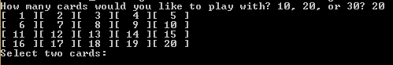
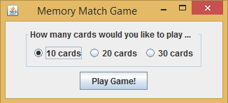
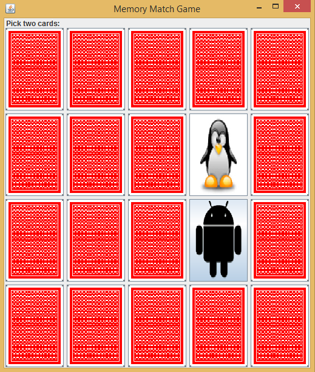

# Memory-Match-Game-GUI
Game created for CS 115 with Austin Beauregard. 

Memory.class is Text-Based version.

 

Memory2.class is GUI Based version. 

This entire folder can be downloaded to your machine and imported as new project into Eclipse (Luna) for both running and for modifying. 
